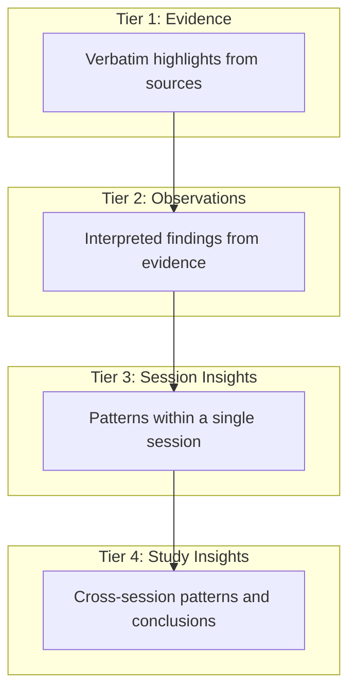
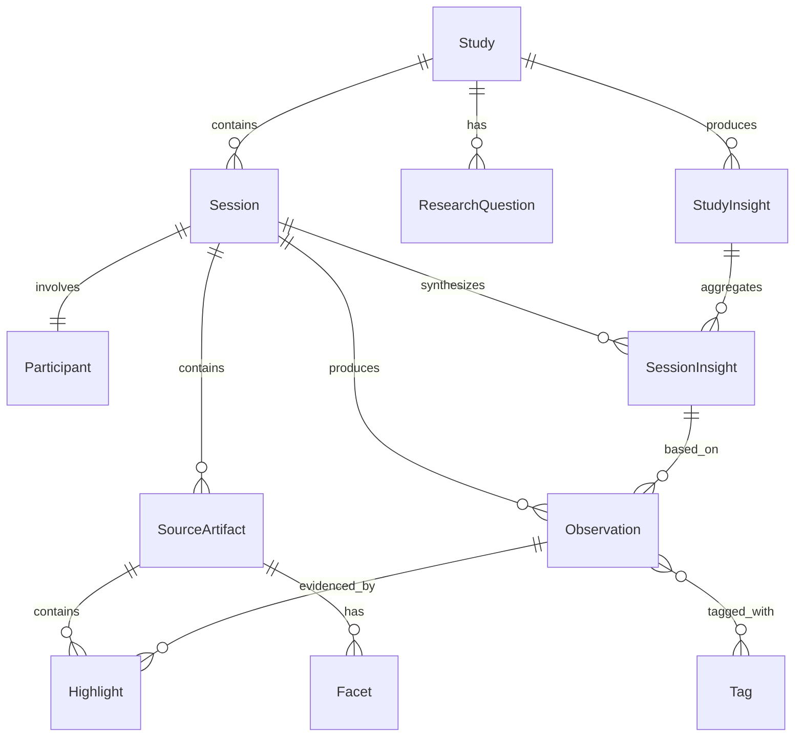
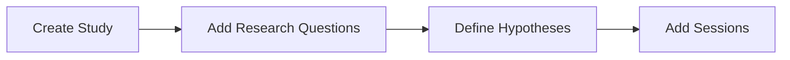
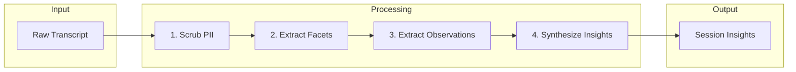
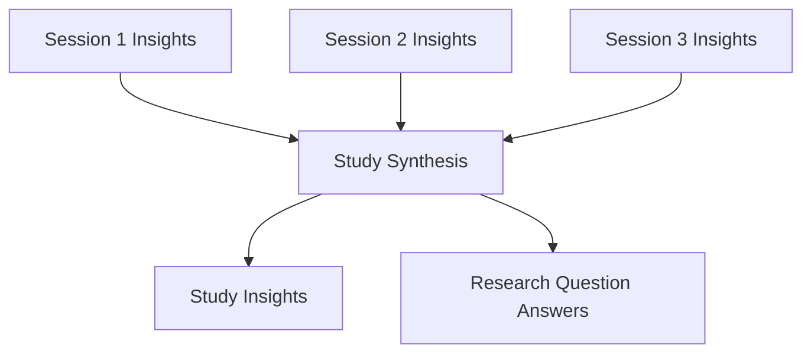
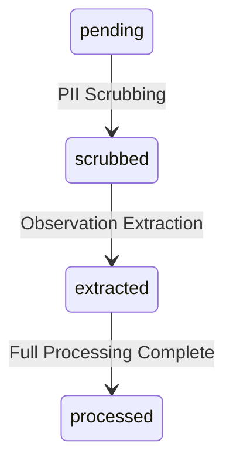
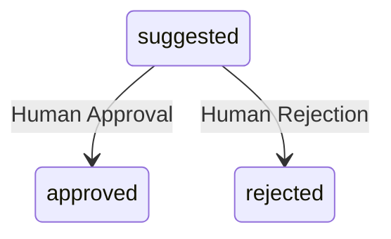

# Attic: Comprehensive System Guide

Attic is a **Human-in-the-Loop (HITL) Knowledge Repository** for UX Research, built on the principles of Atomic Research methodology. This document explains the core concepts, architecture, workflows, and AI capabilities that power Attic.

---

## Table of Contents

1. [Introduction](#introduction)
2. [Atomic Research Methodology](#atomic-research-methodology)
3. [Data Architecture](#data-architecture)
4. [Core Workflows](#core-workflows)
5. [AI Processing Pipeline](#ai-processing-pipeline)
6. [Taxonomy and Tagging](#taxonomy-and-tagging)
7. [Facets System](#facets-system)
8. [Repository and Knowledge Graph](#repository-and-knowledge-graph)
9. [Status Lifecycle](#status-lifecycle)
10. [Search and Discovery](#search-and-discovery)

---

## Introduction

### What is Attic?

Attic is a research knowledge management system designed to help UX researchers:

- **Systematically organize** qualitative research data (interviews, usability tests, surveys)
- **Extract insights** from raw research with AI assistance
- **Maintain traceability** from high-level insights back to verbatim evidence
- **Discover patterns** across multiple research sessions and studies
- **Ensure GDPR compliance** through automated PII scrubbing

### Core Philosophy

Attic follows a **Human-in-the-Loop** approach:

- **AI suggests, humans decide**: The system uses AI to extract observations and synthesize insights, but every finding requires human approval
- **Traceability by design**: Every insight links back to the evidence that supports it
- **Progressive synthesis**: Raw data flows upward through multiple levels of abstraction, each verified by researchers

### The Problem Attic Solves

Traditional UX research often suffers from:

- Insights trapped in individual documents or researchers' minds
- No systematic way to find patterns across studies
- Difficulty tracing conclusions back to evidence
- Time-consuming manual analysis

Attic addresses these by creating a structured, searchable knowledge base where research compounds over time.

---

## Atomic Research Methodology

Attic implements the **Atomic Research** framework, which organizes research knowledge into a 4-tier pyramid:



### The Four Tiers Explained

| Tier | Name | Description | Example |
|------|------|-------------|---------|
| 1 | **Evidence (Highlights)** | Verbatim quotes from transcripts | "I always forget my password and the reset takes forever" |
| 2 | **Observations** | Interpreted meaning from evidence | User experiences friction with password recovery flow |
| 3 | **Session Insights** | Patterns within one session | Authentication is a major pain point for this user |
| 4 | **Study Insights** | Patterns across sessions | 70% of users struggle with password recovery |

### Why This Matters

- **Traceability**: Every Study Insight can be traced down to the exact quotes that support it
- **Confidence**: You can see how many sessions and observations support each insight
- **Auditability**: Stakeholders can verify conclusions by examining the evidence chain

---

## Data Architecture

### Core Entities

Attic organizes research data into the following hierarchy:



### Entity Definitions

#### Study
The top-level container for a research effort. Contains:
- **Name and description**: What the research is about
- **Research Questions**: Specific questions the study aims to answer
- **Hypotheses**: Initial assumptions to validate or invalidate
- **Sessions**: Individual research interactions

#### Session
A single research interaction with one participant:
- **Participant**: The person involved (with privacy-safe identifier)
- **Modality**: Remote, in-person, or async
- **Source Artifacts**: The raw content (transcripts, notes)
- **Context Notes**: Additional context about the session

#### Participant
Represents a research participant with privacy-preserving attributes:
- **Smart ID**: Auto-generated identifier (e.g., "Alice-35-K")
- **Demographics**: Gender, age, country, role (USER/MERCHANT)
- **Has Kids**: Family status for segmentation

#### SourceArtifact
Raw research content attached to a session:
- **Type**: transcript, observer_notes, interviewer_notes, survey, feedback
- **Raw Content**: Original uploaded text
- **Scrubbed Content**: PII-redacted version
- **Status**: Processing state (pending → scrubbed → extracted → processed)

#### Highlight
Verbatim evidence extracted from source content:
- **Snippet Text**: The exact quote
- **Position**: Character offsets in the source (startPos, endPos)
- **Linked Observations**: Which observations cite this evidence

#### Observation
An interpreted finding from the research:
- **Text**: The researcher's interpretation (not a raw quote)
- **Type**: Classification (observation, problem, preference, workaround, quote_summary, hypothesis)
- **Status**: Approval state (suggested, approved, rejected)
- **Highlights**: Evidence that supports this observation
- **Facet Values**: Structured metadata for filtering

#### SessionInsight
A synthesized pattern from observations within one session:
- **Text**: The insight statement
- **Type**: pattern, need, opportunity, friction, behavior
- **Status**: draft, verified, published
- **Observations**: The observations that support this insight

#### StudyInsight
A cross-session pattern representing a validated finding:
- **Title**: Concise insight title
- **Description**: Detailed explanation
- **Status**: open, validated, stale, deprecated
- **Prevalence**: How many sessions support this (e.g., "14 of 32 sessions")
- **Session Insights**: The session-level insights that aggregate into this

#### ResearchQuestion
A specific question the study aims to answer:
- **Text**: The question itself
- **Status**: open, answered, deprecated
- **AI Answer**: Generated answer based on session insights
- **Confidence**: high, medium, low

---

## Core Workflows

### 1. Study Setup



1. **Create a Study** with name, description, and optional hypotheses
2. **Add Research Questions** to guide analysis
3. **Create Sessions** as you conduct research

### 2. Session Processing Pipeline

Each session goes through a 4-step AI-assisted pipeline:



#### Step 1: PII Scrubbing
- AI identifies and redacts personally identifiable information
- Names → [Participant], [Interviewer], [Person]
- Companies → [Company]
- Locations → [Location]
- Contact info → [Contact]
- **Human role**: Review and approve the scrubbed text

#### Step 2: Facet Extraction
- AI extracts structured metadata from the content
- Product areas, topics, emotions, journey stages
- **Human role**: Review auto-detected facets

#### Step 3: Observation Extraction
- AI suggests observations from the transcript
- Each observation links to verbatim evidence (highlights)
- **Human role**: Approve, reject, or edit each observation

#### Step 4: Session Synthesis
- AI groups approved observations into session-level insights
- Identifies patterns, needs, opportunities, friction points
- **Human role**: Verify synthesized insights

### 3. Study Synthesis

Once multiple sessions have approved observations:



- AI identifies patterns that appear across multiple sessions
- Calculates prevalence (how many sessions support each pattern)
- Generates answers to research questions with confidence levels
- **Human role**: Validate cross-session conclusions

---

## AI Processing Pipeline

Attic uses OpenAI's GPT models for various AI-assisted tasks. Each capability is designed for human oversight.

### AI Capabilities Overview

| Capability | Purpose | Input | Output | Human Approval |
|------------|---------|-------|--------|----------------|
| **PII Scrubbing** | GDPR compliance | Raw transcript | Cleaned text | Review scrubbed content |
| **Facet Extraction** | Metadata tagging | Session content | Structured facets | Review auto-tags |
| **Observation Extraction** | Find insights | Scrubbed content | Suggested observations | Approve/reject each |
| **Session Synthesis** | Pattern discovery | Approved observations | Session insights | Verify insights |
| **Study Synthesis** | Cross-session patterns | Session insights | Study insights | Validate conclusions |
| **RQ Analysis** | Answer questions | Session insights | Answers with themes | Review answers |

### PII Scrubbing Details

The scrubber follows strict GDPR guidelines:

```
Input: "John from Oslo called about his account. His email is john@example.com"
Output: "[Person] from [Location] called about his account. His email is [Contact]"
```

**Preservation rules**:
- Context and meaning are preserved
- Formatting (markdown, HTML) is maintained
- No content is invented or added

### Observation Extraction Details

The extractor identifies six types of observations:

| Type | Description | Example |
|------|-------------|---------|
| `observation` | Neutral behavioral finding | User scrolls past the help section |
| `problem` | Pain point or frustration | User cannot find the settings menu |
| `preference` | Stated or implied preference | User prefers dark mode |
| `workaround` | Creative user solution | User takes screenshot to remember settings |
| `quote_summary` | Memorable verbatim quote | "This is the most confusing app I've ever used" |
| `hypothesis` | Inferred motivation | User may be avoiding the feature due to past negative experience |

Each observation includes:
- **Text**: Interpreted statement (not raw quote)
- **Highlights**: 1-3 verbatim evidence snippets
- **Type classification**

### Session Synthesis Details

The synthesizer groups observations into insights:

| Insight Type | Description |
|--------------|-------------|
| `pattern` | Recurring theme or behavior |
| `need` | Unmet user need |
| `opportunity` | Potential improvement area |
| `friction` | Pain point or obstacle |
| `behavior` | Notable user behavior |

**Rules**:
- Each insight must be supported by at least 2 observations
- Insights should be actionable statements, not summaries
- Focus on the "why" not just the "what"

### Study Synthesis Details

Cross-session synthesis produces:
- **Study Insights**: Patterns appearing in 2+ sessions
- **Prevalence**: "14 of 32 sessions (44%)"
- **Contradictions**: Conflicting findings between sessions
- **Limitations**: Gaps in the data
- **Confidence level**: high, medium, low

---

## Taxonomy and Tagging

Attic uses a structured taxonomy system for consistent categorization across all research.

### Tag Categories

| Category | Purpose | Examples |
|----------|---------|----------|
| **Product Area** | Which product/feature | Payments, Login, Profile |
| **Domain / Topic** | Subject matter | Accessibility, Performance, Security |
| **Emotion** | Emotional state | Frustration, Confusion, Delight |
| **Feedback Type** | Nature of feedback | Bug report, Feature request, Praise |
| **Workflow / Journey** | User journey stage | Onboarding, Purchase, Support |
| **User Segment** | User type | New user, Power user, Merchant |
| **External Entities** | External references | Competitor mentions, Third parties |

### Aliases and Multilingual Support

Tags support:
- **Aliases**: Alternative names for the same concept
- **Locale names**: Translations for multilingual transcripts
- **Descriptions**: Guidance for consistent application

Example:
```
Tag: "Vippsnummer"
Aliases: ["Vipps number", "Vipps-nummer"]
Locale names: { "en": "Vipps Number", "nb": "Vippsnummer" }
```

### How AI Uses Taxonomy

During extraction, the AI:
1. Receives the full taxonomy with aliases
2. Matches content to canonical tag names
3. Uses deterministic post-processing to catch alias matches
4. Ensures consistent tagging across all research

---

## Facets System

Facets are structured metadata descriptors that enable powerful filtering and discovery.

### Facet Types

| Facet | Description | Values |
|-------|-------------|--------|
| `product` | Product/feature discussed | App name, feature name |
| `topic` | Main topic | onboarding, payments, support |
| `role` | User's role | consumer, merchant, admin |
| `journeyStage` | Journey phase | discovery, purchase, post-purchase |
| `market` | Geographic segment | Norway, Sweden, Denmark |
| `emotion` | Emotional state | frustrated, confused, delighted |
| `valence` | Sentiment | positive, negative, neutral, mixed |
| `device` | Device context | mobile, desktop, iOS, Android |

### Confidence Scoring

Each extracted facet includes a confidence score:

| Score | Meaning |
|-------|---------|
| 1.0 | Explicitly stated in content |
| 0.8 | Strongly implied |
| 0.6 | Moderately implied |
| 0.4 | Weakly implied |

Facets with confidence below 0.5 are excluded from filtering by default.

### How Facets Enable Discovery

Facets power the Repository filtering:
- Filter observations by product, emotion, journey stage
- Find all "frustrated" observations about "payments"
- Compare findings across markets or user segments
- Track sentiment trends over time

---

## Repository and Knowledge Graph

The Repository page provides a visual exploration interface for all research data.

### Graph Visualization

The knowledge graph displays:
- **Nodes**: Studies, Sessions, Observations, Insights, Tags
- **Links**: Relationships between entities
- **Colors**: Node type differentiation
- **Size**: Relative importance or count

### Filtering Capabilities

| Filter | Options |
|--------|---------|
| **Node Types** | Study, Session, Observation, SessionInsight, StudyInsight, Tag |
| **Status** | Approval status (approved, suggested, rejected) |
| **Role** | Participant role (USER, MERCHANT) |
| **Country** | Geographic filter |
| **Tag Categories** | Filter by tag category or specific tags |
| **Date Range** | Presets (last 7 days, 30 days) or custom range |
| **Observations** | Minimum observation count for insights |
| **Orphans** | Show/hide unconnected nodes |

### Node Details Panel

Clicking a node reveals:
- Full content and metadata
- Related entities (linked observations, sessions)
- Tags and facets
- Navigation to source session/study
- Delete option for observations

---

## Status Lifecycle

Entities in Attic progress through defined status states.

### Source Artifact Status



| Status | Description |
|--------|-------------|
| `pending` | Raw content, not yet processed |
| `scrubbed` | PII removed, ready for extraction |
| `extracted` | Observations extracted |
| `processed` | Fully processed with facets |

### Observation Status



| Status | Description |
|--------|-------------|
| `suggested` | AI-generated, pending review |
| `approved` | Human-verified, included in synthesis |
| `rejected` | Dismissed, excluded from analysis |

### Session Insight Status

| Status | Description |
|--------|-------------|
| `draft` | AI-generated, pending verification |
| `verified` | Human-verified |
| `published` | Finalized and shareable |

### Study Insight Status

| Status | Description |
|--------|-------------|
| `open` | Active finding |
| `validated` | Confirmed with additional evidence |
| `stale` | May need re-evaluation |
| `deprecated` | No longer relevant |

### Staleness Tracking

Attic tracks "staleness" for insights:
- When underlying observations change, insights are marked stale
- Researchers can re-synthesize to update conclusions
- Ensures insights stay current with latest data

---

## Search and Discovery

Attic provides semantic search across all research data.

### Semantic Search

Search functionality for finding research data:
- Find content across entity types
- Ranked by relevance score
- Database-based search (vector search planned for future)

### Searchable Content

| Entity | Searchable Fields |
|--------|-------------------|
| Study Insight | Title, description |
| Session Insight | Text content |
| Observation | Text, evidence snippets |

### Search Results

Results include:
- **Title**: Entity title or truncated text
- **Description**: Context (participant, study name)
- **Type**: Entity type badge
- **Score**: Relevance ranking
- **Link**: Navigate to source session/study

### Integration with Knowledge Graph

Search results integrate with the graph:
- Matching nodes highlighted
- Connected nodes shown for context
- Filter by search terms in real-time

---

## Technical Stack

For reference, Attic is built with:

| Component | Technology |
|-----------|------------|
| Framework | Next.js 14 (App Router) |
| Database | SQLite via Prisma ORM |
| AI | OpenAI GPT-4o |
| UI | Tailwind CSS, Radix UI |
| Graph | D3.js / react-force-graph |
| Editor | TipTap |

---

## Quick Reference

### Observation Types

| Type | Icon | Use When |
|------|------|----------|
| observation | 👁️ | Neutral finding or behavior |
| problem | ❌ | Pain point, frustration, blocker |
| preference | ❤️ | Stated or implied preference |
| workaround | 🔧 | User-created solution |
| quote_summary | 💬 | Memorable verbatim quote |
| hypothesis | 💡 | Inferred motivation or cause |

### Insight Types

| Type | Use When |
|------|----------|
| pattern | Recurring theme across observations |
| need | Unmet user need identified |
| opportunity | Potential improvement area |
| friction | Pain point or obstacle |
| behavior | Notable user behavior pattern |

### Confidence Levels

| Level | Meaning |
|-------|---------|
| high | Strong evidence, consistent across sessions |
| medium | Moderate evidence, some variation |
| low | Limited evidence, needs more data |

---

## Best Practices

### For Researchers

1. **Review AI suggestions carefully** - AI extracts patterns but may miss context
2. **Approve selectively** - Quality over quantity for observations
3. **Add context notes** - Help future researchers understand session context
4. **Use consistent tags** - Leverage the taxonomy for consistent categorization
5. **Verify synthesis** - Always review AI-generated insights before sharing

### For Study Leads

1. **Define clear research questions** - They guide AI synthesis
2. **Monitor prevalence** - Look for patterns across 3+ sessions
3. **Track staleness** - Re-synthesize when data changes
4. **Export insights** - Share validated findings with stakeholders

---

## Glossary

| Term | Definition |
|------|------------|
| **Atomic Research** | Methodology for breaking research into reusable, traceable units |
| **Facet** | Structured metadata descriptor (product, topic, emotion, etc.) |
| **Highlight** | Verbatim quote from source content |
| **HITL** | Human-in-the-Loop: AI assists, human decides |
| **Observation** | Interpreted finding from research evidence |
| **Prevalence** | How many sessions support a finding |
| **Scrubbing** | Removing PII from content for GDPR compliance |
| **Session** | Single research interaction with one participant |
| **Staleness** | When insights may need re-evaluation |
| **Study** | Container for a research effort with multiple sessions |
| **Synthesis** | Process of combining observations into insights |
| **Taxonomy** | Structured tag system for categorization |
